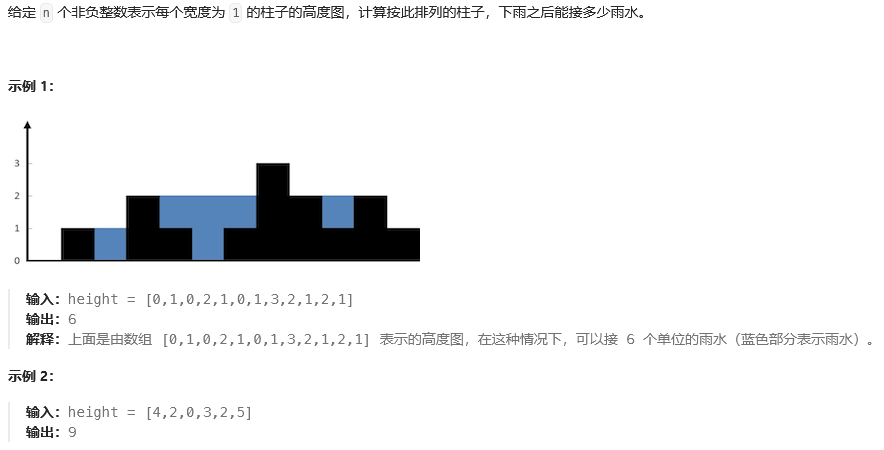

## 1、如何排查一条慢SQL？可以从哪些方面入手？（SQL）
1. 如果是一个sql，可以通过explain的指令去查这个sql的执行计划。（索引失效会导致sql的执行变为全表扫描或选择错误的索引，在explain中一般是type=ALL或者type=index）
2. 如果有数据库终端的话，也可以通过开启mysql的慢日志查询，设置好时间阈值，进行捕获
## SQL优化
SQL语句的优化方式主要是通过选择合适的索引、优化查询语句、避免全表扫描等提高查询效率，减少慢SQL的出现
### 索引
索引主要用于加快数据的查询速度，有了正确的索引，数据库就可以根据索引的数据结构快速定位到匹配的数据行，从而提高查询效率和响应速度。在慢SQL中由于索引导致的主要有两个方面：**索引缺失**（没有索引） 与 **索引失效**

一般在以下场景需要为相应的列创建索引：
- 字段有唯一性限制
- 经常用于where查询条件的字段
- 经常用于group by和order by的字段，可以避免排序

但并不是每个字段都要添加上索引，以下场景添加上索引会加重DB的负担：
- 不用于查询条件的字段
- 字段中存在大量重复的数据
- 数据量太少
- 频繁更新的字段（考虑）

## 2、说一说关于lambda函数的知识（C++）
1. 利用lambda表达式可以编写内嵌的匿名函数，用以替换独立函数或者函数对象
2. 每当你定义一个lambda表达式后，编译器会自动生成一个匿名类（这个类重载了()运算符），我们称为闭包类型（closure type）。那么在运行时，lambda表达式就会返回一个匿名的闭包实例，其实一个右值
3. lambda可以忽略参数列表和返回值，但必须永远包含捕获列表和函数体

## 3、在浏览器地址栏输入一个URL后回车，背后会进行哪些技术步骤？（计网）
1. 域名解析 
   - 查浏览器本地缓存
   - 检查本机host文件
   - 向DNS服务器发送DNS查询请求获取IP地址
2. 发起TCP的3次握手
3. 建立TCP连接后发起http请求
4. 服务器响应http请求，浏览器得到html代码
5. 浏览器解析html代码，并请求html代码中的资源（js、css、图片等）
6. 浏览器对页面进行渲染呈现给用户

## 4、如何设计一个高性能/高并发/高可用/高可靠/可扩展的系统? 
1. 无锁化
2. 零拷贝
3. 序列化
4. 池子化
5. 并发化
6. 异步化
7. 缓存
8. 分片
9. 存储

## 5、事务四大特性（ACID）原子性、一致性、隔离性、永久性（MySql）
### 原子性
原子性是指事务包含的所有操作要么全部成功，要么全部失败回滚，因此事务的操作如果成功就必须要完全应用到数据库，如果操作失败则不能对数据库有任何影响
### 一致性
事务开始前和结束后，数据库的完整性约束没有被破坏。比如A向B转账，不可能A扣了钱，B却没收到
### 隔离性
隔离性是当多个用户并发访问数据库时，比如操作同一张表，数据库为每一个用户开启的事务，不能被其他事务所干扰，多个并发事务之间要相互隔离。
同一时间，只允许一个事务请求同一数据，不同的事务之间彼此没有任何干扰。比如A正在从一张银行卡中取钱，在A取钱的过程结束前，B不能向这张卡转账。

事务隔离分为不同级别，包括读未提交、读提交、可重复读和串行化
### 持久性
持久性是指一个事物一旦被提交了，那么对数据库中的数据的改变就是永久性的，即便是在数据库系统遇到故障的情况下也不会丢失提交事务的操作

## 6、接雨水（数据结构）
[link](https://leetcode.cn/problems/trapping-rain-water/)


## 7、TCP是如何保证可靠传输的？（计网）
tcp的序列号可以避免乱序的问题，保证收到的tcp报文都是有序的。
在 TCP 中，当发送端的数据到达接收主机时，接收端主机会返回一个确认应答消息，表示已收到消息。
TCP 针对数据包丢失的情况，会用重传机制解决。
用快重传解决个别报文段的丢失问题。
使用滑动窗口实现流量控制。使用接收方确认报文中的窗口字段来控制发送方发送窗口大小，进而控制发送方的发送速率，使得接收方来得及接收。
使用基于窗口的拥塞控制，来尽量避免避免网络拥塞。
- 建立连接（标志位）：通信前确认通信实体存在
- 序号机制（序号、确认号）：确保了数据是按序、完整到达
- 数据校验（校验和）：CRC校验全部数据
- 超时重传（定时器）：保证因链路故障未能到达数据能够被多次重发
- 窗口机制（窗口）：提供流量控制，避免过量发送
- 拥塞控制：同上

## 8、线程与进程的比较或者说区别？（操作系统）
关于线程：线程启动速度快，轻量级；线程的系统开销小；线程使用有一定难度，需要处理数据一致性问题；同一线程共享的有堆、全局变量、静态变量、指针，引用、文件等，而独自占有栈
- 调度：线程是调度的基本单位（PC，状态码，通用寄存器，线程栈及栈指针）；进程是拥有资源的基本单位（打开文件，堆，静态区，代码段等）
- 并发性：一个进程内多个线程可以并发（最好和CPU核数相等）；多个进程可以并发
- 拥有资源：线程不拥有系统资源，但一个进程的多个线程可以共享隶属进程的资源；进程是拥有资源的独立单位
- 系统开销：线程创建销毁只需要处理PC值，状态码，通用寄存器值，线程栈及栈指针即可；进程创建和销毁需要重新分配及销毁task_struct结构（是Linux中描述进程的结构体）

## 9、数据库的事务隔离级别有哪些？（MySql）
### 未提交读
事务中发生了修改，即使没有提交，其他事务也是可见的。比如对于一个数A原来50修改为100，但是我还没有提交修改，另一个事务看到这个修改，而这个时候原事务发生了回滚，这时候A还是50，但是另一个事务看到的A是100。**可能导致脏读、幻读或不可重复读**
### 提交读
对于一个事务从开始直到提交之前，所做的任何修改是其他事务不可见的。举例就是对于一个数A原来是50，然后提交修改为100，这个时候另一个事务在A提交修改之前，读取的A是50，刚读取完，A就被修改成100，这个时候另一个事务再进行读取发现A就突然变成100了。**可以阻止脏读，但是幻读或不可重复读仍有可能发生**
### 重复读
就是对一个记录读取多次的记录是相同的。比如对于一个数A读取的话一直是A，前后两次读取的A是一致的。**可以阻止脏读和不可重复读，但幻读仍有可能发生**
### 可串行化读
在并发情况下，和串行化的读取的结果是一致的，没有什么不同。比如不会发生脏读和幻读。**该级别可以防止脏读、不可重复读以及幻读**


MySql InnoDB 存储引擎的默认支持的隔离级别是REPEATABLE-READ（可重读）

## 10、C++11有哪些新特性？（C++）
- nullptr代替了NULL
- 引入了 auto 和 decltype 这两个关键字实现了类型推导
- 基于范围的for循环 for (auto &i : res) {}
- 类和结构体的初始化列表
- Lambda表达式（匿名函数）
- std::forward_list（单向链表）
- 右值引用和move语义
- 无序容器和正则表达式
- 成员变量默认初始化
- 智能指针等

## 11、Linux和Windows下的进程通信方法和线程通信方法分别有哪些？（操作系统）
### 进程通信方法

- **管道**（pipe）：允许一个进程和另一个与它有共同祖先的进程之间进行通信
- **命名管道**（FIFO）：类似于管道，但是它可以用于任何两个进程之间的通信，命名管道在文件系统中有对应的文件名。命名管道通过命名mkfifo或系统调用mkfifo来创建
- **消息队列**（MQ）：消息队列是消息的连接表，包括POSIX消息队列和System V消息队列。有足够权限的进程可以向队列中添加消息，被赋予读权限的进程则可以读走队列中的消息。消息队列克服了信号承载信息量少，管道只能承载无格式字节流以及缓冲区大小受限等缺点
- **信号量**（semaphore）：信号量主要作为进程间以及同进程不同线程之间的同步手段
- **共享内**存(shared memory)：它使得多个进程可以访问同一块内存空间， **是最快的可用IPC形式。** 这是针对其他通信机制运行效率较低而设计的。它往往与其他通信机制，如信号量结合使用，以达到进程间的同步及互斥
- **信号**（signal）：信号是比较复杂的通信方式，用于通知接收进程有某种事情发生，除了用于进程间通信外，进程还可以发送信号给进程本身
- **内存映射**(mapped memory)：内存映射允许任何多个进程间通信，每一个使用该机制的进程通过把一个共享的文件映射到自己的进程地址空间来实现它
- **Socket**：它是更为通用的进程间通信机制，可用于不同机器之间的进程间通信
### 线程通信方法
#### Linux
- **信号**：类似进程间的信号处理
- **锁机制**：互斥锁、读写锁和自旋锁
- **条件变量**：使用通知的方式解锁，与互斥锁配合使用
- **信号量**：包括无名线程信号量和命名线程信号量
#### Windows
- **全局变量**：需要有多个线程来访问一个全局变量时，通常我们会在这个全局变量前加上volatile声明，以防编译器对此变量进行优化
- **Message消息机制**：常用的Message通信的接口主要有两个：PostMessage和PostThreadMessage，PostMessage为线程向主窗口发送消息。而PostThreadMessage是任意两个线程之间的通信接口
- **CEvent对象**：CEvent为MFC中的一个对象，可以通过对CEvent的触发状态进行改变，从而实现线程间的通信和同步，这个主要是实现线程直接同步的一种方法

## 12、TCP和UDP的区别（计网）
1. TCP是面向连接的协议，建立和释放连接需要进行三次握手和四次挥手。UDP是面向无连接的协议，无需进行三次握手和四次挥手。说明udp比TCP实时性更强。
2. TCP 是流式传输，没有边界，但保证顺序和可靠。UDP 是一个包一个包的发送，是有边界的，但可能会丢包和乱序。
3. TCP连接的可靠性强，UDP的可靠性不强
4. TCP只能一对一，UDP支持一对多和多对多
5. TCP的头部开销比UDP大。TCP 首部长度较长，会有一定的开销，首部在没有使用「选项」字段时是 20 个字节，如果使用了「选项」字段则会变长的。UDP 首部只有 8 个字节，并且是固定不变的，开销较小。

## 13、具体说一下计算机网路三握四挥中的四挥？尽可能说的具体点（计网）
建立一个连接需要三次握手，而终止一个连接要经过四次挥手。这由TCP的半关闭（half-close）造成的。

所谓的半关闭，其实就是TCP提供了连接的一端在结束它的发送后还能接收来自另一端数据的能力。

TCP 的连接的拆除需要发送四个包，因此称为四次挥手(Four-way handshake)，客户端或服务器均可主动发起挥手动作。
### 初始化状态
客户端和服务端都在连接状态，接下来开始进行四次分手断开连接操作
### 第一次挥手
第一次分手无论是客户端还是服务端都可以发起，因为 TCP 是全双工的。

假如客户端发送的数据已经发送完毕，发送FIN = 1（seq = u）告诉服务端。此时客户端处于 FIN_WAIT1 状态，不再发送数据，等待服务端确认。
### 第二次挥手
服务端接收到客户端的释放请求连接之后，会发送ACK = 1（确认号ack = u + 1）告诉客户端收到你发给我的信息，此时服务端处于 CLOSE_WAIT 等待关闭状态。客户端收到确认后进入FIN_WAIT2状态
### 第三次挥手
如果服务端也想断开连接了，和客户端的第一次挥手一样，发给 FIN 报文，且指定一个序列号（w）。服务端进入LAST_ACK（最后确认）状态，等待客户端的确认。
### 第四次挥手
客户端收到 FIN 之后，发送一个 ACK = 1，确认号 = w + 1 的报文作为应答，此时客户端处于 TIME_WAIT 状态。服务端收到 ACK 报文之后，就处于关闭连接了，处于 CLOSED 状态。此时TCP未释放掉，需要经过时间等待计时器设置的时间2MSL后，客户端才进入CLOSED状态。

## 14、Redis怎么实现分布式锁？（redis）
应用程序获取redis的连接，然后发送一个命令获取锁。
命令：SETNX。这个指令是Redis里的原子命令，可以把一个key设置其对应的value。

Redis 的 SET 命令有个 NX 参数可以实现「key不存在才插入」，所以可以用它来实现分布式锁：
- 如果 key 不存在，则显示插入成功，可以用来表示加锁成功；
- 如果 key 存在，则会显示插入失败，可以用来表示加锁失败。

符合要求的分布式命令：`SET lock_key unique_value NX PX 10000 `———
lock_key 就是 key 键；
unique_value 是客户端生成的唯一的标识，区分来自不同客户端的锁操作；
NX 代表只在 lock_key 不存在时，才对 lock_key 进行设置操作；
PX 10000 表示设置 lock_key 的过期时间为 10s，这是为了避免客户端发生异常而无法释放锁。

## 15、在并发编程时，在需要加锁时，不加锁会有什么问题？
两个线程使用同一个全局变量会有不一致的问题，比如a线程把全局变量加1，b线程读的时候，如果还是从缓存中读的，那么会没有发现这个更新，就会产生不一致的问题。

## 16、Go协程的的通讯有哪些方式？
共享内存、消息传递、信号量

## 17、说说你了解的死锁？包括死锁产生原因、必要条件、处理方法、死锁回复以及死锁预防等（操作系统）
死锁是指两个（多个）线程（进程）互相等待对方数据（资源）的过程，死锁的产生会导致程序卡死，不解锁程序将永远无法进行下去。
### 死锁产生原因
理论上认为死锁产生有以下四个必要条件，缺一不可：
1. 互斥条件：进程对所需求的资源具有排他性，若有其他进程请求该资源，请求进程只能等待。
2. 不剥夺条件：进程已获得的资源未释放前，不能被其他进程强行夺走，只能自己释放。
3. 请求和保持条件：进程当前所拥有的资源在进程请求其他新资源时，由该进程继续占有。
4. 循环等待条件：存在一种进程资源循环等待链，链中每个进程已获得的资源同时被链中下一个进程所请求。
### 死锁演示
```cpp
#include <iostream>
#include <vector>
#include <list>
#include <thread>
#include <mutex>

using namespace std;

class A
{
public:
    // 插入消息，模拟消息不断产生
    void insertMsg()
    {
        for (int i = 0; i < 100; i++)
        {
            cout << "插入一条消息:" << i << endl;
            my_mutex1.lock(); // 语句1
            my_mutex2.lock(); // 语句2
            Msg.push_back(i);
            my_mutex2.unlock();
            my_mutex1.unlock();
        }
    }

    // 读取消息
    void readMsg()
    {
        int MsgCom;
        for (int i = 0; i < 100; i++)
        {
            // MsgCom = MsgLULProc(i);
            if (MsgLULProc(MsgCom))
            {
                // 读出消息了
                cout << "消息已读出" << endl;
            }
            else
            {
                // 消息暂时为空
                cout << "消息为空" << endl;
            }
        }
    }

    // 加解锁代码
    bool MsgLULProc(int &command)
    {
        int curMsg;
        my_mutex2.lock(); // 语句3
        my_mutex1.lock(); // 语句4
        if (!Msg.empty())
        {
			// 读取消息，读完删除
			command = Msg.front();
			Msg.pop_front();

			my_mutex1.unlock();
			my_mutex2.unlock();
			return true;
        }
		my_mutex1.unlock();
		my_mutex2.unlock();
		return false;
    }

private:
    list<int> Msg;   // 消息变量
    mutex my_mutex1; // 互斥量对象1
    mutex my_mutex2; // 互斥量对象2
};

int main()
{
	A a;
	// 创建一个插入消息线程
	thread insertTd(&A::insertMsg, &a); // 这里要传入引用保证是同一个对象
	// 创建一个读取消息线程
	thread readTd(&A::readMsg, &a); // 这里要传入引用保证是同一个对象
	insertTd.join();
	readTd.join();

	return 0;
}
```
语句1和语句2表示线程A先锁资源1，再锁资源2，语句3和语句4表示线程B先锁资源2再锁资源1，具备死锁产生的条件。
### 死锁的解决方案
保证上锁的顺序一致。
### 处理方法
主要有以下四种方法：鸵鸟策略、死锁检测与死锁回复、死锁预防、死锁避免
#### 鸵鸟策略
把头埋在沙子里，假装根本没发生问题。
因为解决死锁问题的代价很高，因此鸵鸟策略这种不采取任务措施的方案会获得更高的性能。

当发生死锁时不会对用户造成多大影响，或发生死锁的概率很低，可以采用鸵鸟策略。
#### 死锁检测
不试图阻止死锁，而是当检测到死锁发生时，采取措施进行恢复。

CPU占有率低, 指令:`px -aux | grep 程序名`查看进程状态，会发现一堆锁的请求
#### 死锁恢复
- 利用抢占恢复
- 利用回滚恢复
- 通过杀死进程恢复
#### 死锁预防
1. 破坏互斥条件
2. 破坏请求和保持条件

	一种实现方式是规定所有进程在开始执行前请求所需要的全部资源

3. 破坏不剥夺条件
   
   允许抢占资源

4. 破坏循环请求等待

	给资源统一编号，进程只能按编号顺序来请求资源

#### 死锁避免
在程序运行时避免发生死锁。
用特定算法检查一个状态是否安全。如果一个状态不是安全的，需要拒绝进入这个状态。

## 18、HTTPS和HTTP的区别（计网）
1. HTTP协议传输的数据都是未加密的，也就是明文的，因此使用HTTP协议传输隐私信息非常不安全，HTTPS协议是由SSL+HTTP协议构建的可进行加密传输、身份认证的网络协议，要比HTTP协议安全。
2. https协议需要到ca申请证书，一般免费证书较少，因而需要一定费用。
3. http和https使用的是完全不同的连接方式，用的端口也不一样，前者是80，后者是443

## 19、讲一下程序的内存分布/内存模型？（C++）
内存分区，分别是堆、栈、自由存储区、全局/静态存储区、常量存储区和代码区。


### 栈：
在执行函数时，函数内局部变量的存储单元都可以在栈上创建，函数执行结束时这些存储单元自动被释放。栈内存分配运算内置于处理器的指令集中，效率很高，但是分配的内存容量有限
### 堆：
就是那些由`new`分配的内存块，他们的释放编译器不去管，由我们的应用程序去控制，一般一个`new`就要对应一个`delete`。如果程序员没有释放掉，那么在程序结束后，操作系统会自动回收
### 自由存储区：
如果说堆是操作系统维护的一块内存，那么自由存储区就是C++中通过new和delete动态分配和释放对象的抽象概念。需要注意的是，自由存储区和堆比较像，但不等价。(待商榷)

通过new来申请的内存区域可称为自由存储区。基本上，所有的C++编译器默认使用堆来实现自由存储，也即是缺省的全局运算符new和delete也许会按照malloc和free的方式来被实现，这时藉由new运算符分配的对象，说它在堆上也对，说它在自由存储区上也正确。但程序员也可以通过重载操作符，改用其他内存来实现自由存储，例如全局变量做的对象池，这时自由存储区和堆区就有区别了。
### 对于堆和自由存储区的理解
当一个程序使用new 或 malloc函数申请内存时，它会从自由存储区中请求一段连续的内存空间，这段内存空间同时也是位于堆上的。（注意，堆是指数据结构，存储动态分配内存的空间，而自由存储区就是实际的内存空间）

MSDN：The `new` operator is used to allocate objects and arrays of objects. The `new` operator allocates from a program memory area called the “free store.” In C, the free store is often referred to as the “heap.”
### 全局/静态存储区：
全局变量和静态变量被分配到同一块内存中，在以前的C语言中，全局变量和静态变量又分为初始化的和未初始化的，在C++里面没有这个区分了，它们共同占用同一块内存区，在该区定义的变量若没有初始化，则会被自动初始化，例如int型变量自动初始为0
### 常量存储区：
这是一块比较特殊的存储区，这里面存放的是常量，不允许修改
### 代码区：
存放函数体的二进制代码

## 20、Redis的五种底层数据结构整理
### 简单动态字符串(Simple Dynamic String，SDS)
SDS等同于C语言中的char * ，但它可以存储任意二进制数据，不像C语言字符串那样以字符’\0’来标识字符串的结束，因此它必然有个长度字段（还有个未使用字节的长度字段）。

优点：
- 获取字符串长度的复杂度为O(1)。
- 杜绝缓冲区溢出。
- 减少修改字符串长度时所需要的内存重分配次数。
- 二进制安全。
- 兼容部分C字符串函数。
### 链表
当有一个列表键包含了数量比较多的元素，Redis就会使用链表作为列表键的底层实现。
### 字典
字典的底层是哈希表

**哈希冲突的解决方式：**
Redis的哈希表使用链地址法来解决键冲突，每个哈希表节点都有一个next指针，多个哈希表节点可以用这个单向链表连接起来，这就解决了键冲突的问题。
### 跳跃表
### 压缩列表
压缩列表(ziplist)是列表键和哈希键的底层实现之一。当一个列表键只包含少量列表项，并且每个列表项要么就是小整数值，要么就是长度比较短的字符串，那么Redis就会使用压缩列表来做列表键的底层实现。

看他的名字就能看出来，是为了节省内存造的列表结构。